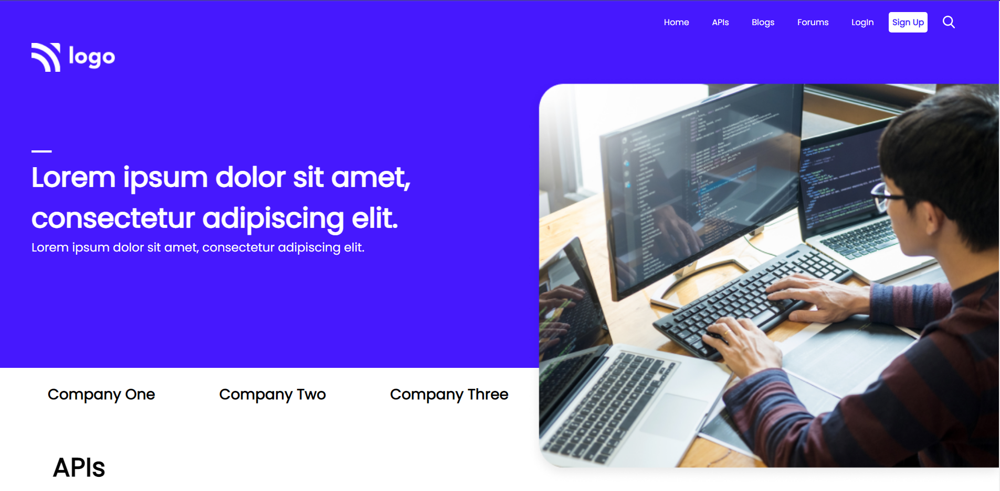
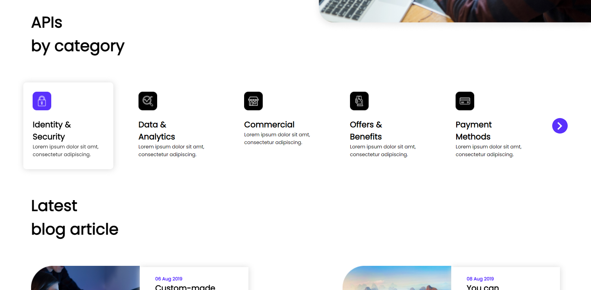
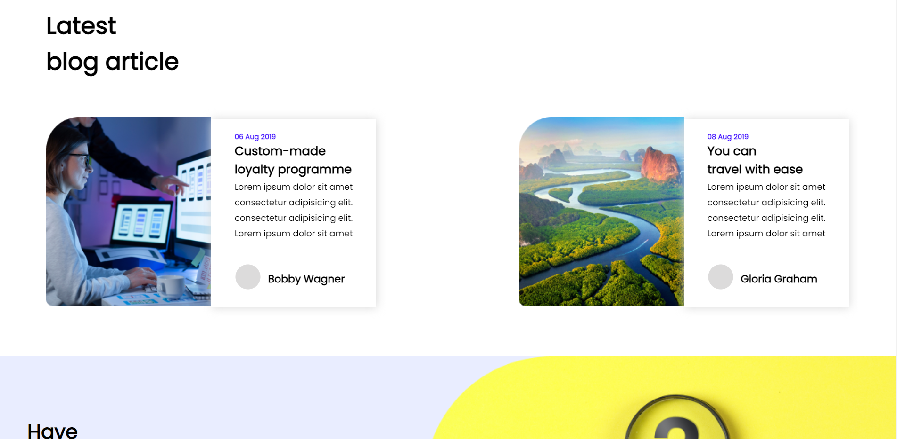
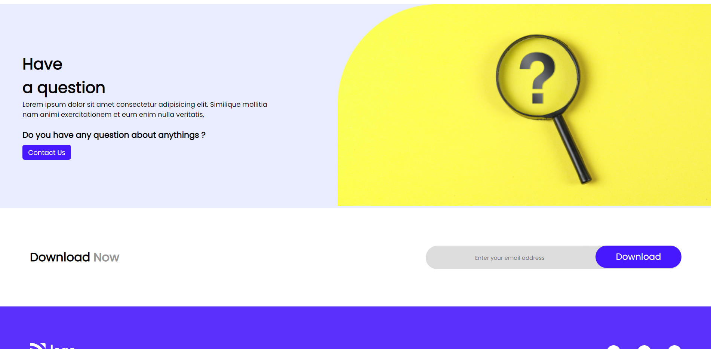
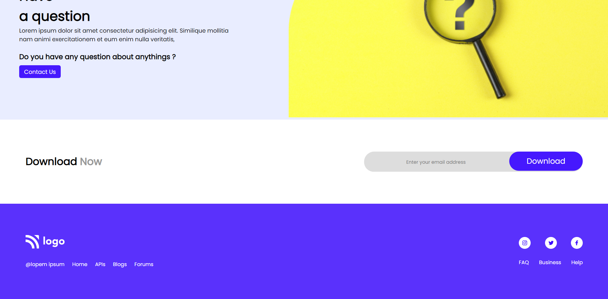

# HTML and CSS assignment Ineuron

A Developer Business Wesbite Lnading Page template designed purely with `HTML` and `CSS` that is made up of: 
- Navbar
- Header Section
- Custom designed cards 
- Blog cards
- Footer Section

### Languages Used:
#### HTML and CSS
  
 
### Name
`Rishabh Thakur`
### Learning Outcome:
- Learnt to use Positions
  - `Absolute` vs `Relative` in defining positions of images on web-page
- Flexbox
  - Learnt how to use `flexbox` and its different properties to create well- structured  website layouts.
   - Align items
   - Justify Content
   - Flex Wrap
- Learnt how to use `margins` and `paddings` in CSS to customise layout designs.
- How to use `Vercel` to deploy and host websites through `Github`.

***

### Screenshots

***

***

***

***

***

***

### Landing Page

***

### Time to finish up the Project 
  `4 hours`

### Deployed Link
[HTML and CSS Assignment]()

***